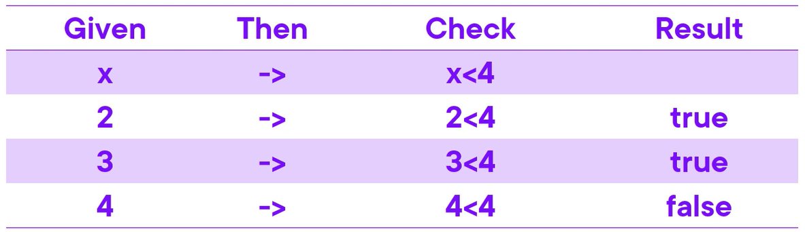
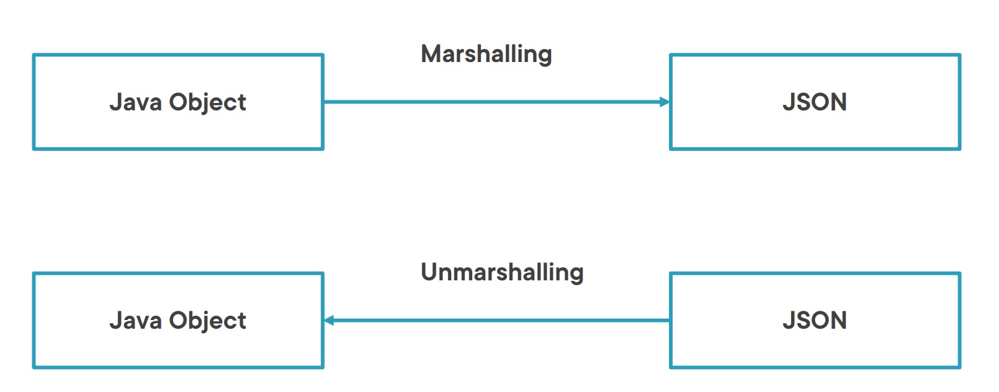

# REST Assured Study Guide


### Prerequisites

* Java 8 or above
* IDE: IntelliJ or Eclipse
* Maven
* Test Runner: JUnit or TestNG

### Step 1: Download and Install Java JDK

Java needs to be present on your system to run tests.
Follow the guide here to install and setup Java JDK on your system: [Java JDK Installation Guide](https://qaautomation.expert/2020/10/01/how-to-download-install-java-jdk-11-in-windows/)

Run `java -version` to confirm Java JDK is successfully installed.

Download and install IntelliJ or Eclipse.

### Step 2: Download and setup IntelliJ

An IDE (integrated development environment) provides strong support for Java developers, which is needed to write Java code.

**IntelliJ IDE** or **Eclipse IDE**

### Step 3: Setup Maven

Maven is a build manageme
nt tool that is used to define project structure, dependencies, build, and test management.

1. Visit here for Maven setup guide [Maven Guide](https://qaautomation.expert/2019/08/24/how-to-install-maven-on-windows/).
2. Run `mvn -version` to verify successful installation.

### Step 4: Create Maven project

1. Launch IntelliJ IDE
2. Click on **New** and then **Project** option.
3. Enter Project name.
4. Select **Jave** from the *Language* option.
5. Select **Maven** from the *Build System* option.
6. Click **Create**.

### Step 5 – Add REST Assured and TestNG dependencies to the project
Add the following dependencies to your `pom.xml` file

REST Assured dependency: Includes JsonPath & XmlPath
```
<dependencies>
  <dependency>
      <groupId>io.rest-assured</groupId>
      <artifactId>rest-assured</artifactId>
      <version>5.5.1</version>
      <scope>test</scope>
  </dependency>

  
  <!-- json-schema-validator dependency -->
  <dependency>
      <groupId>io.rest-assured</groupId>
      <artifactId>json-schema-validator</artifactId>
      <version>5.5.1</version>
      <scope>test</scope>
  </dependency>

  <!--testNG -->
  <dependency>
    <groupId>org.testng</groupId>
    <artifactId>testng</artifactId>
    <version>7.9.0</version>
    <scope>test</scope>
  </dependency>
</dependencies>
```  

------------

### Today 07-03-2025

* Rest Assured Fluent Interface
* Header & Body Validation
* Debugging Tests
* Schema Validation
* Groovy Language (Collections & Extract)


### DSL with a Fluent Interface
#### Components of Fluent Interface

* **DSL:** A language focused on a particular domain and its keywords reflect that domain.
* **Method Chaining:** A technique based on a special syntax for invoking multiple method call in a single statement without storing the intermediate results.


Examples of uses of fluent interface
Specialized and fluent:

* REST Assured: focused on testing
* Java 8 Streams: focused on the domain of data processing
* jOOQ: focused on databases
* AssertJ: Focused on the domain of writing assertions

**Java 8 streams**

```java
double avg = Arrays.asList(1, 5, 8 6).stream()
  .filter(...)
  .summaryStatistics().getAverage();
```

**AssertJ**

```java
assertThat(fruitList)
  .hasSize(9)
  .contains(“apple”,“pear”)
  .doesNotContain(“banana”)
```


### Lambda and Functions



```
 Stream.of(2, 4, 8, 6, 9)
	.filter(x -> x > 4)
	.forEach(System.out::println);
```

* The `.filter(Predicate p)` implements the Predicate Functional Interface.
* 4 Other Functional interfaces are provided
    * Consumer
    * Predicate
    * Supplier
    * Function: `.header(String header, Function f, Matcher m)`

**NB:** For Functions, provide lambdas of this form: `Function<InputType, OutputType> ...`
```
String dateToString(LocalDate date) {
	return date.getDateOfMonth() + " of" + date.getMonth();
}
```

#### Simple Verification
```
.header(String header, String v) // if header contains a Number, has be verified as a string
.header(String header, Matcher m)
```

#### Advanced
```
.header(String header, Function f, Matcher m)
.header(String header, ResponseAwareMatcher m)
```
* Given a string header, apply a conversion/mapper function f, use Matcher m to compare to expected value.

* **`ResponseAwareMatcher`:** Allows comparing a header to smth else available in the Response 


A network of logically interconnected classes with method chaining that enables us to write readable and elegant code.


### Today 07-03-2025

### JsonPath & Groovy Language (Collections & Extract)
* .size(), .max(), .min(), 
* .findAll
* .extract()


### Object Mapping (Marshalling/Unmarshalling)

* Marshalling: The process of transforming the memory representation of an object to
  a data format suitable for storage or transmission
* Unmarshalling: opposite of marshalling


#### `Syntax
```java
.as(Class<T> cls)
.as(Class<T> cls, ObjectMapperType mapperType)
.as(Class<T> cls, ObjectMapper mapper
```

------------


### Week 5: Test Automation Framework Basics
* Integrating REST-assured with TestNG or JUnit:
  * Structuring test cases (TestNG Annotations). 
  * Using data providers for parameterized tests.

* Introduction to Maven:
  * Dependency management for REST-assured.
  * Running tests via Maven.

* Configuring reusable components:
  * Setting up base URIs and base paths.
  * Using request and response specifications.


## APIs

* https://api.github.com/
* https://jsonplaceholder.typicode.com/
* https://reqres.in/

